# Домашняя работа № 2 и 3

## Задача 1

### 1а

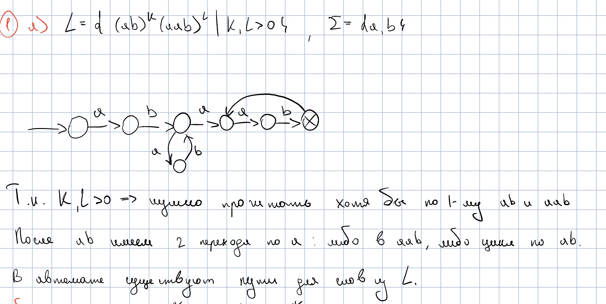

### 1b

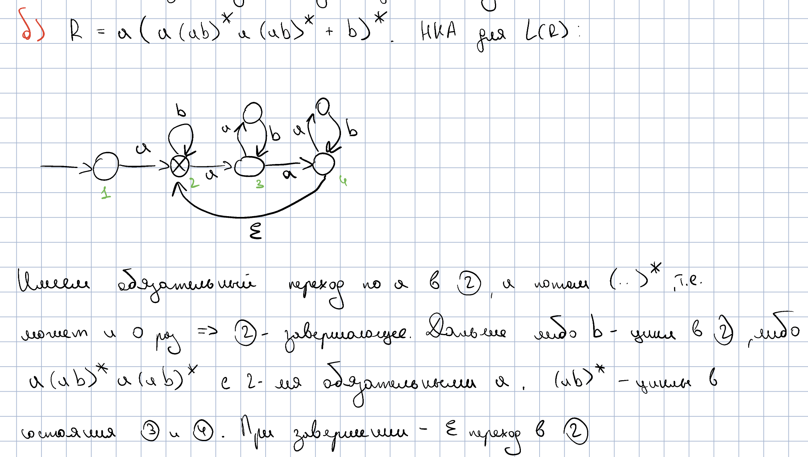

### 1c

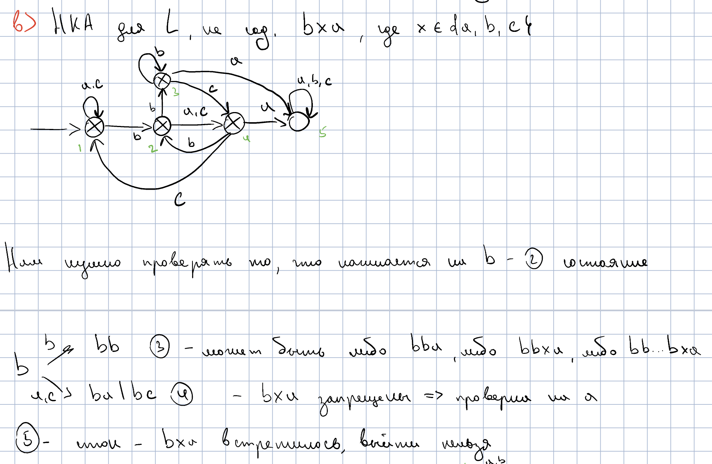

## Задача 2

### 2а

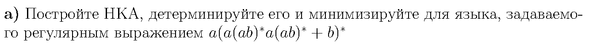

#### НКА

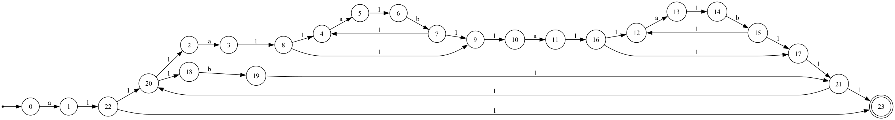

#### ДКА

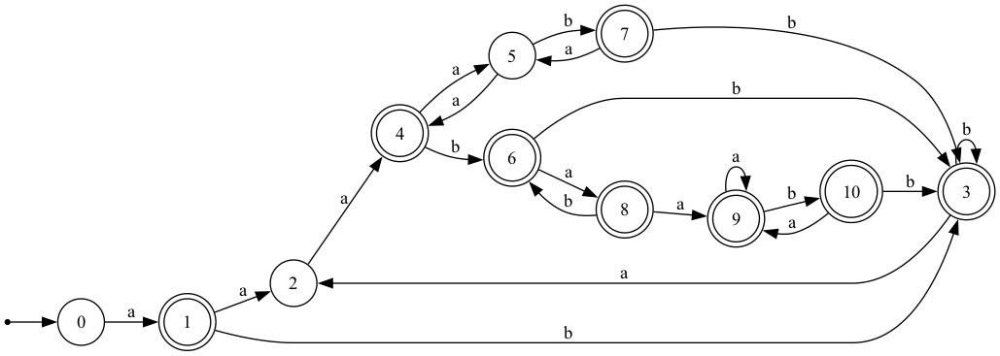

#### Полный минимальный ДКА

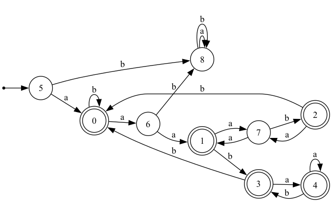

### 2b

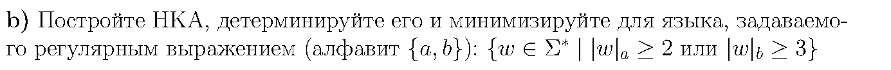

#### НКА

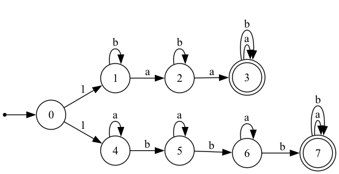

#### ДКА

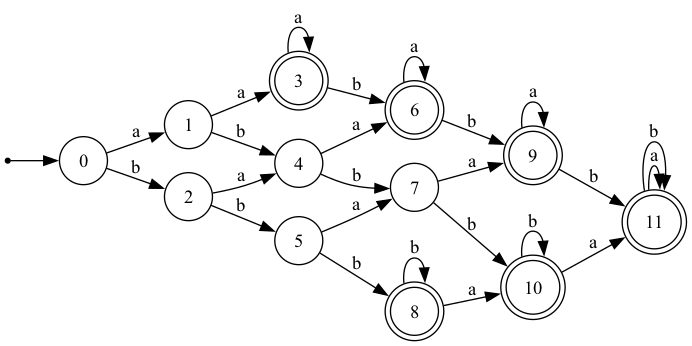

#### Полный минимальный ДКА

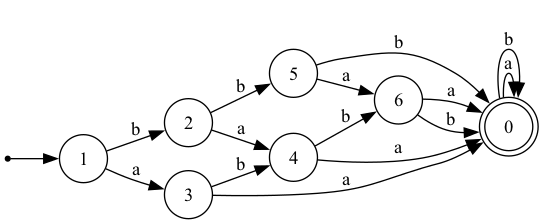

### 2c

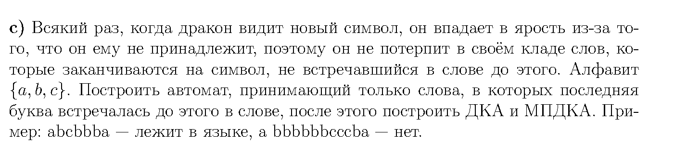

#### НКА

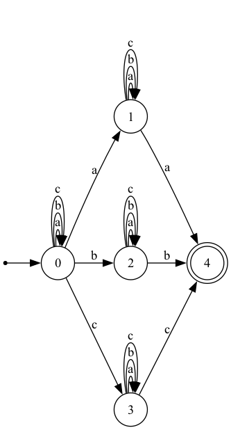

#### ДКА

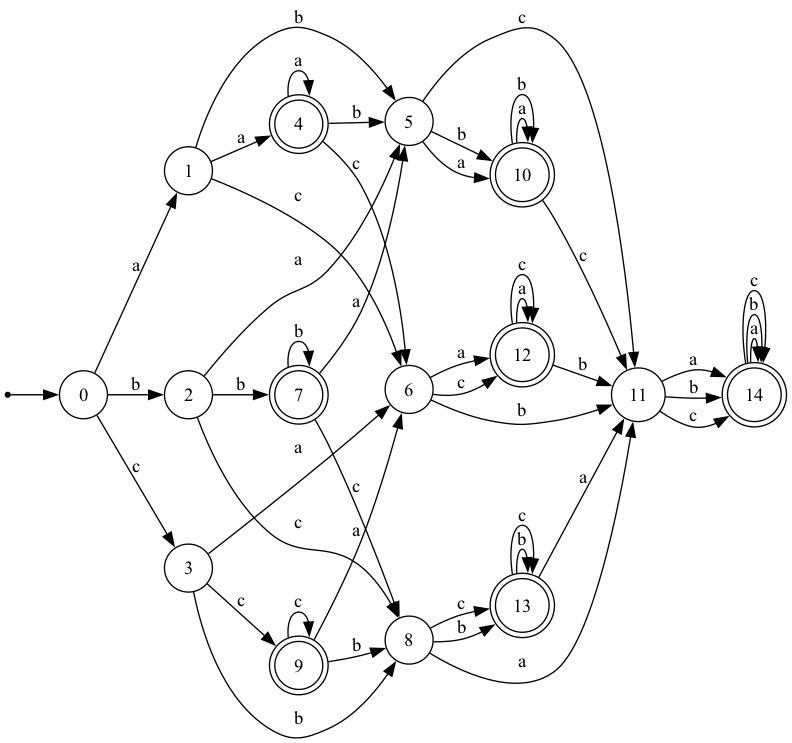

#### Полный минимальный ДКА

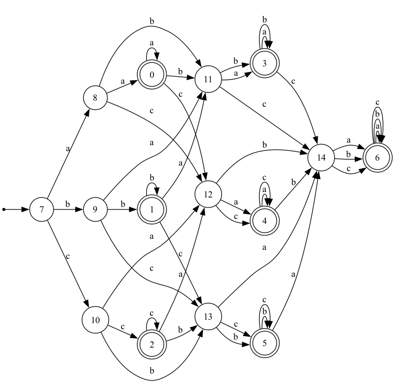

## Задача 3

На схеме метка `1` на ребре означает ε.

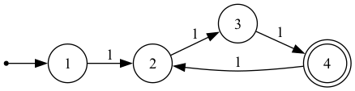

Если каждый раз выбирать ε-переход, выходящий из вершины 1, получаем:

| Удаляем | Из выходящего ребра следующей вершины добавляем |
| ------- | ----------------------------- |
| `1 → 2` | `1 → 3`, так как есть `2 → 3` |
| `1 → 3` | `1 → 4`, так как есть `3 → 4` |
| `1 → 4` | `1 → 2`, так как есть `4 → 2` |

Остальные три ребра не меняются. После третьего шага граф снова совпадает с исходным, поэтому такой допустимый запуск алгоритма повторяется бесконечно. Следовательно, алгоритм не гарантирует завершения.

## Задача 4

### 4а

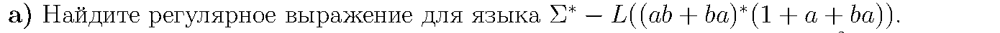

Пусть P — объединение пар ab и ba. Хвост ba уже содержится в повторении P, поэтому исходное выражение упрощается (1 обозначает пустое слово):

$$P=ab+ba,\qquad P^{\ast}(1+a+ba)=P^{\ast}(1+a)$$

В слове из этого языка каждая полная пара букв, считая от начала, равна ab или ba. Если после пар остаётся одна буква, это должна быть a.

Если встречается первая неподходящая пара aa или bb, до неё идут пары из P, а после неё — любой суффикс:

$$P^{\ast}(aa+bb)(a+b)^{\ast}$$

Если все пары подходят, но слово нечётной длины заканчивается на b, получаем:

$$P^{\ast}b$$

Объединяя оба случая, получаем регулярное выражение для дополнения:

$$(ab+ba)^{\ast}\bigl((aa+bb)(a+b)^{\ast}+b\bigr)$$

### 4b

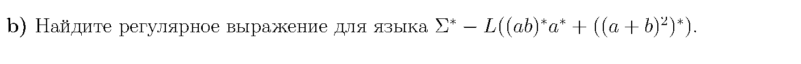

Обозначим через E язык всех слов чётной длины:

$$E=\bigl((a+b)^2\bigr)^{\ast}$$

Исходный язык содержит E целиком, поэтому в дополнении могут быть только слова нечётной длины. Возьмём максимально длинный начальный фрагмент из пар ab. Если дальше идут только буквы a, слово принадлежит исходному языку. Иначе после серии из a встретится b. Серия не может состоять ровно из одной a: тогда пара ab вошла бы в начальный фрагмент.

Если число букв a в этой серии чётное, включая ноль, после следующей b остаётся чётный суффикс:

$$(ab)^{\ast}(aa)^{\ast}bE$$

Если число букв a нечётное и не меньше трёх, после следующей b остаётся нечётный суффикс:

$$(ab)^{\ast}(aa)^{\ast}aaab(a+b)E$$

Объединяя случаи и подставляя E, получаем искомое выражение:

$$(ab)^{\ast}(aa)^{\ast}\bigl(b+aaab(a+b)\bigr)\bigl((a+b)^2\bigr)^{\ast}$$

## Задача 5

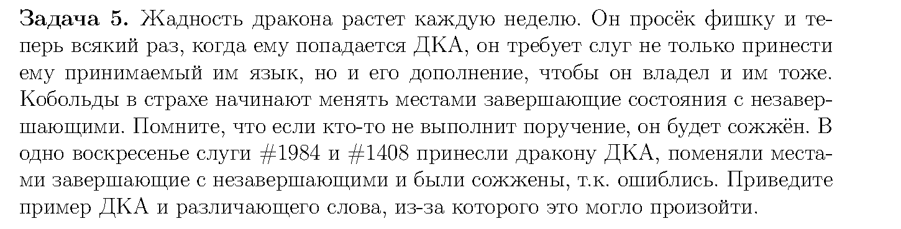

Возьмём неполный ДКА над алфавитом {a, b}:

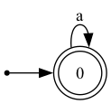

Состояние 0 начальное и завершающее. По a есть петля, по b перехода нет, поэтому язык автомата:

$$L(M)=a^{\ast}$$

Если сделать состояние 0 незавершающим, автомат станет отвергать все слова. Но слово b должно входить в дополнение, так как исходный автомат его не принимает. Искомое слово — b.

Причина в неполноте автомата. Перед тем как поменять состояния нужно добавить стоковую вершину.

## Задача 6

### 6а

Язык бесконечен тогда и только тогда, когда на пути от начального состояния к завершающему есть цикл, на котором читается хотя бы один символ.

1. Обходом графа найдём состояния, достижимые из начального. Обходом по обратным рёбрам найдём состояния, из которых достижимо завершающее. Оставим только состояния, попавшие в оба множества.
2. Алгоритмом Косарайю разобьём оставшийся граф на компоненты сильной связности.
3. Если внутри какой-либо компоненты есть переход по символу, язык бесконечен. Иначе язык конечен.

Все обходы и алгоритм Косарайю работают за O(|Q| + |E|), где Q — множество состояний, а E — множество переходов.

### 6b

Пусть известно, что у автомата n состояний. Проверим функцией все слова длины от n до 2n−1. Язык бесконечен тогда и только тогда, когда хотя бы одно из них принимается.

Принятое слово длины не меньше n содержит в пути к завершающему состоянию цикл, который можно повторять. Если кратчайшее такое слово было бы длиннее 2n−1, из его пути можно удалить цикл длины не больше n и получить более короткое принятое слово длины не меньше n.

Число вызовов функции:

$$\sum_{k=n}^{2n-1}|\Sigma|^k=O(|\Sigma|^{2n})\quad\text{при }|\Sigma|\ge2.$$

## Задача 8

Метод `minimize_brzozowski()` выполняет обращение рёбер и обмен начальных и завершающих состояний, детерминизацию, затем повторяет эти два шага. В конце он делает ДКА полным и возвращает минимальный автомат.

Для проверки минимальности берём каждую пару разных состояний и ищем различающее слово обходом графа пар. Если удаётся прийти к паре, где ровно одно состояние завершающее, слово найдено. Если для какой-то пары такого слова нет, состояния эквивалентны и автомат не минимален.
